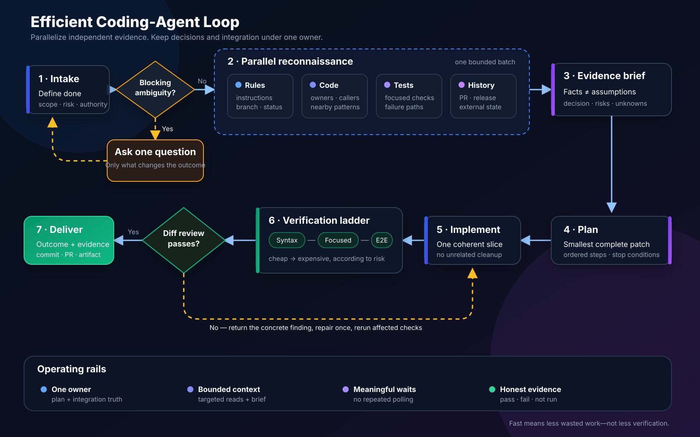

# Fast, Reliable AI Coding-Agent Workflow

This guide is a model- and platform-agnostic workflow for making coding agents faster without trading away correctness. It is based on ordinary software-engineering practices: bounded discovery, parallel evidence gathering, explicit acceptance criteria, layered verification, and concise handoffs.

It does not depend on any private orchestration system.

<p align="center">
  
</p>

## The short version

For most coding tasks, use this loop:

1. **Define done** in observable terms.
2. **Inspect once, in parallel**: repository rules, status, relevant files, history, and external state when needed.
3. **Write a short evidence brief** before editing.
4. **Choose the smallest patch** that satisfies the contract.
5. **Verify from cheap to expensive**: syntax, focused tests, integration tests, then full checks only when justified.
6. **Review the final diff as a stranger** would.
7. **Deliver evidence**, not a diary of every command.

The biggest speed gains usually come from removing repeated discovery and unnecessary full test runs—not from making the model type faster.

## Why coding agents become slow

| Cause | Typical symptom | Better approach |
|---|---|---|
| No definition of done | The agent keeps exploring or polishing | Start with acceptance criteria and stop conditions |
| Serial reconnaissance | It reads one file, thinks, then reads another | Batch independent reads and searches |
| Too much context | Long pauses and forgotten constraints | Keep a compact evidence brief; load only relevant ranges |
| Premature implementation | Several patches are rewritten | Confirm interfaces, conventions, and tests first |
| Full-suite testing after every edit | Most time is spent waiting | Use a verification ladder |
| Too many agents | Handoffs cost more than the work | Delegate only independent uncertainty |
| No single owner | Conflicting edits and duplicated work | One coordinator owns the plan and integration |
| Polling long commands | Repeated empty status checks | Start once and wait on a meaningful condition |
| Vague prompts | The agent asks avoidable questions | State scope, constraints, permissions, and deliverables |
| No final diff review | Small mistakes survive tests | Review only the changed surface before delivery |

## A practical time budget

For a normal, medium-sized change, start with these limits and adjust for risk:

| Phase | Suggested share | Output |
|---|---:|---|
| Intake and contract | 5–10% | Task card |
| Reconnaissance | 15–20% | Evidence brief |
| Plan | 5–10% | Ordered patch plan |
| Implementation | 35–45% | Focused diff |
| Verification | 20–30% | Test evidence |
| Review and delivery | 5–10% | Clean handoff |

A security-sensitive migration may need much more verification. A one-line documentation correction should need much less reconnaissance. The point is to make endless exploration visible.

## The five highest-value improvements

### 1. Give every task a contract

Before tools or edits, reduce the request to:

```text
Goal:
In scope:
Out of scope:
Constraints:
Acceptance criteria:
Required evidence:
```

An agent can stop confidently only when “done” is testable.

### 2. Batch independent discovery

A good first tool batch often includes:

- repository status and recent commits;
- repository instruction files;
- the files named by the user;
- targeted symbol or text searches;
- issue, PR, release, or documentation state if the task references it.

These do not depend on one another, so running them serially adds latency without adding quality.

Do not batch dependent actions. For example, do not edit a function before the search that identifies its callers has completed.

### 3. Keep one source of truth

Use a short evidence brief such as:

```text
Observed:
- The fork has tags but no published releases.
- install.sh resolves /releases/latest and therefore fails.
- The custom dashboard is generated during the frontend build.

Decision:
- Prefer a fork release when available.
- Otherwise build this fork's source so branding is preserved.

Risks:
- Source fallback needs Go, Node, and npm.
- Installer variables must be passed to sh, not curl.
```

This prevents the agent from repeatedly rediscovering facts or drifting away from earlier decisions.

### 4. Verify through a ladder

Run the cheapest useful check first:

1. formatting and whitespace;
2. parser, syntax, or type checks;
3. tests nearest the changed code;
4. package or subsystem tests;
5. integration or end-to-end tests;
6. full CI-equivalent suite.

Move upward only when the change's risk or dependency surface justifies it. Record anything that could not run and why.

### 5. Delegate uncertainty, not typing

A specialist worker is useful when it can answer an independent question, for example:

- “Which code paths own authentication?”
- “What did the referenced PR actually change?”
- “Which tests cover this behavior?”
- “Review this final diff for security regressions.”

A specialist is usually wasteful when the coordinator could answer the question with one search or when multiple workers would edit the same files.

## Recommended artifacts

For long tasks, keep four small artifacts in memory or in a temporary task directory:

| Artifact | Purpose | Maximum useful size |
|---|---|---:|
| Task card | Scope and acceptance criteria | 10–20 lines |
| Evidence brief | Confirmed facts with file/line references | 20–40 lines |
| Decision log | Non-obvious choices and rejected alternatives | 5–15 entries |
| Verification matrix | Checks, outcomes, and omissions | One table |

Do not turn these into permanent repository files unless they have lasting value for maintainers.

## Use the rest of this pack

- [Operating Playbook](./OPERATING_PLAYBOOK.md) — the detailed end-to-end procedure
- [Prompt Templates](./PROMPT_TEMPLATES.md) — copyable prompts for coordinators, scouts, implementers, and reviewers
- [Measurement and Tuning](./MEASUREMENT.md) — how to find where time is actually going
- [Workflow diagram](./workflow.svg) — standalone schematic

## Adopt it in 30 minutes

1. Add the task-card template to your agent's default prompt.
2. Require one batched reconnaissance step before implementation.
3. Define your repository's focused test commands.
4. Require a final `git diff --check`, focused tests, and diff review.
5. Log phase timings for the next ten tasks.
6. Fix the largest measured delay instead of changing everything at once.

The goal is not maximum parallelism. The goal is minimum wasted work with enough evidence to trust the result.
